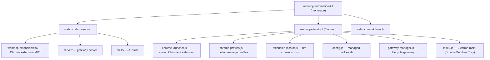
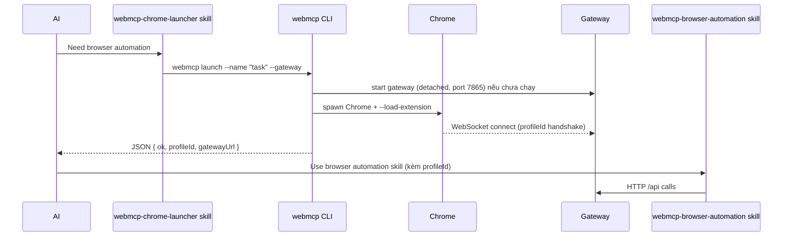

# Tách Chrome Launcher + Extension thành package riêng & viết Skill cho AI

> [!IMPORTANT]
> **Chrome 137+**: stable/beta Chrome đã gỡ bỏ command-line switch `--load-extension`
> (và cả escape hatch `--disable-features=DisableLoadExtensionCommandLineSwitch`) từ
> M137. Các bước "Chrome mở → `chrome://extensions` có extension" bên dưới chỉ đúng
> với Chromium / Chrome for Testing / Canary / Dev, hoặc stable/beta < M137. Trên
> stable Chrome hiện đại phải load unpacked thủ công (persist theo profile) hoặc
> trỏ `WEBMCP_CHROME_BINARY` sang build tương thích. Xem
> [20260702_chrome-137-load-extension-compat.md](20260702_chrome-137-load-extension-compat.md).

> [!NOTE]
> **Revised 2026-07-02** — đối chiếu lại với code thực tế. Các thay đổi chính so với bản 2026-07-01:
> 1. CLI entry là `bin/webmcp.mjs` (ESM), không phải `bin/webmcp.js` — cần quyết định module format (đã chốt: CJS + `createRequire`).
> 2. Phát hiện gap quan trọng: `managedSessions` Map là in-memory, chết theo process → CLI ngắn hạn cần **persist session state ra disk**.
> 3. Bổ sung các bước bị thiếu: cập nhật `files` trong package.json, cập nhật `install-agent.mjs` (đang hardcode 1 skill), flow `--relaunch` cho CLI, spawn gateway detached.
> 4. Chốt các Open Questions (extend package hiện có, `~/.webmcp/`).

## Phân tích hiện trạng

### Kiến trúc hiện tại



### Các module liên quan trong `webmcp-desktop/src/main/`

| File | Vai trò | Phụ thuộc Electron? |
|---|---|---|
| [chrome-launcher.js](file:///Users/ttcenter/Desktop/VIBE_CODE/webmcp-automation-kit/webmcp-desktop/src/main/chrome-launcher.js) | Tìm Chrome binary, spawn Chrome + extension, quản lý managed sessions | ❌ Không (dùng `child_process`, `fs`, `os`) |
| [chrome-profiles.js](file:///Users/ttcenter/Desktop/VIBE_CODE/webmcp-automation-kit/webmcp-desktop/src/main/chrome-profiles.js) | Đọc `Local State` của Chrome, liệt kê profiles | ❌ Không |
| [extension-locator.js](file:///Users/ttcenter/Desktop/VIBE_CODE/webmcp-automation-kit/webmcp-desktop/src/main/extension-locator.js) | Tìm extension dist/ folder | ❌ Không |
| [config.js](file:///Users/ttcenter/Desktop/VIBE_CODE/webmcp-automation-kit/webmcp-desktop/src/main/config.js) | Paths & settings | ⚠️ Optional `electron.app.getPath()`, fallback là `os.tmpdir()` — **không dùng được cho CLI** (profiles sẽ bị OS dọn) |
| [gateway-manager.js](file:///Users/ttcenter/Desktop/VIBE_CODE/webmcp-automation-kit/webmcp-desktop/src/main/gateway-manager.js) | Start/stop gateway process | ❌ Không |
| [index.js](file:///Users/ttcenter/Desktop/VIBE_CODE/webmcp-automation-kit/webmcp-desktop/src/main/index.js) | Electron BrowserWindow, Tray, IPC | ✅ **Có** — Electron core |

### Hiện trạng package `@gyga-browser/webmcp-browser-automation-kit` (đã verify)

- CLI entry: **`bin/webmcp.mjs`** (ESM) với các subcommand `mcp`, `gateway start|health`, `health`, `call`, `workflow`, `extension-path`. Package **không có** `"type": "module"` → file `.js` mặc định là CJS; CLI đã dùng sẵn `createRequire`.
- `package.json#files` là whitelist — **mọi thư mục mới (chrome-launcher/, skill mới) phải được thêm vào đây** thì mới ship khi `npm publish`.
- `scripts/install-agent.mjs` hardcode `SKILL_NAME = 'webmcp-browser-automation'` — chỉ cài đúng 1 skill vào `~/.claude/skills`, `~/.codex/skills`, v.v.
- Extension dist hardcode `WS_URL = 'ws://localhost:7865'` ([ws-client.js L4](file:///Users/ttcenter/Desktop/VIBE_CODE/webmcp-automation-kit/webmcp-browser-kit/webmcp-extension/dist/bg/ws-client.js)). Gateway default port 7865. → **CLI phải chạy gateway trên port mặc định 7865**, không dùng random port như desktop app.
- Gateway đã hỗ trợ **multi-profile**: mỗi extension connection có `profileId`; `/health` trả về danh sách `profiles`. Launch flow nên tận dụng để báo cho AI biết profileId nào vừa online.
- `webmcp-desktop` đã depend `@gyga-browser/webmcp-browser-automation-kit@^1.0.22` → bước "desktop import từ package" khả thi ngay.

> [!WARNING]
> **Quan sát ngoài scope (cần verify riêng):** `GatewayManager` của desktop app dùng `findFreePort()` (random port) trong khi extension hardcode `ws://localhost:7865`. Nếu đúng như code hiện tại, extension không bao giờ connect được vào gateway do desktop app khởi động trừ khi trùng port. Nên kiểm tra lại desktop app; CLI mới không được lặp lại pattern này.

---

## Đánh giá: **NÊN tách — nhưng theo cách hợp lý**

### ✅ Lý do NÊN tách

1. **Chrome Launcher hoàn toàn không phụ thuộc Electron**
   - `chrome-launcher.js`, `chrome-profiles.js`, `extension-locator.js` đều chỉ dùng Node.js core modules (`child_process`, `fs`, `os`, `path`)
   - Đây là logic **headless/CLI** bị "nhốt" trong Electron app

2. **AI agents hiện không thể tự launch Chrome + extension**
   - Skill `webmcp-browser-automation` chỉ biết giao tiếp với gateway **đã chạy sẵn**
   - Không có cách nào cho AI tự: (a) tìm Chrome → (b) tạo profile → (c) gắn extension → (d) launch → (e) start gateway
   - Đây là **missing link** quan trọng trong automation pipeline

3. **Tái sử dụng trong nhiều context**
   - CLI scripts, CI/CD, test runners, AI agents — tất cả cần launch Chrome + extension
   - Hiện phải chạy Electron desktop app chỉ để có tính năng này → overkill

4. **Extension dist/ đã là static asset, đã bundle sẵn trong package**
   - `files` đã include `webmcp-extension/dist/`; CLI đã có lệnh `webmcp extension-path` chứng minh path resolve nội bộ package là trivial

### ⚠️ Rủi ro & lưu ý (đã cập nhật)

1. **Không duplicate code** — `webmcp-desktop` phải **import** từ package (đã có dependency), không giữ bản copy.
2. **State launcher là in-memory** — `managedSessions` Map (userDataDir → pid) sống theo process. Desktop app chạy dài nên OK; **CLI là process ngắn hạn** → phải persist ra `~/.webmcp/sessions.json` và validate PID còn sống khi load (`process.kill(pid, 0)`), nếu không sẽ mất khả năng "attach thêm profile window vào Chrome đã flagged" và luôn báo `needsRelaunch` sai.
3. **`needsRelaunch` là flow interactive** — desktop hiện confirm bằng dialog trước khi quit Chrome của user. CLI cần flag `--relaunch` (mặc định KHÔNG tự quit); skill phải dặn AI **hỏi user trước** khi quit Chrome đang chạy.
4. **ESM/CJS**: CLI là `.mjs`, module tách ra giữ CJS (`.js`, vì package không có `"type":"module"`) và CLI import qua `createRequire` (pattern đã có sẵn trong `webmcp.mjs`).
5. **Packaging & installer**: thêm `chrome-launcher/` và `skills/webmcp-chrome-launcher/` vào `package.json#files`; refactor `install-agent.mjs` từ 1 skill hardcoded → danh sách skills.
6. **config fallback `os.tmpdir()` không dùng được** — managed profiles ở tmp sẽ bị dọn; CLI dùng `~/.webmcp/` (override qua `WEBMCP_DATA_DIR`).

---

## Quyết định (chốt các Open Questions cũ)

| Câu hỏi | Quyết định | Lý do |
|---|---|---|
| Package strategy | **Mở rộng `@gyga-browser/webmcp-browser-automation-kit`** | Package đã chứa extension dist, gateway, CLI `webmcp`, installer; desktop đã depend sẵn. Package mới chỉ tăng surface. |
| Config location | **`~/.webmcp/`** (`managed-profiles/`, `sessions.json`), override bằng `WEBMCP_DATA_DIR` | Bền vững, cross-platform, không đụng Electron userData. |
| Scope | **Package refactor + CLI + skill trong cùng một đợt** | Skill không có giá trị nếu CLI chưa tồn tại; viết skill dựa trên desktop app không giúp AI headless. |

### Cấu trúc đề xuất

```
@gyga-browser/webmcp-browser-automation-kit/
├── webmcp-extension/dist/        # ✅ đã có
├── server/                       # ✅ đã có (gateway)
├── chrome-launcher/              # 🆕 NEW (CJS, Node >= 18, zero deps)
│   ├── index.js                  # re-export API
│   ├── launcher.js               # từ chrome-launcher.js (refactored, nhận options)
│   ├── profiles.js               # từ chrome-profiles.js (nhận managedProfilesDir qua param)
│   ├── sessions.js               # 🆕 persist managed sessions ra sessions.json + PID liveness
│   └── config.js                 # pure Node config: ~/.webmcp/ hoặc WEBMCP_DATA_DIR
├── skills/
│   ├── webmcp-browser-automation/  # ✅ đã có — thêm cross-reference sang webmcp-chrome-launcher
│   └── webmcp-chrome-launcher/     # 🆕 NEW
└── bin/
    └── webmcp.mjs                # ✅ đã có — thêm subcommand `launch`, `profiles`
```

Ghi chú: **không cần port `extension-locator.js`** vào package — bên trong package, dist luôn ở `<pkgRoot>/webmcp-extension/dist` (CLI `extension-path` đã làm đúng vậy). Locator chỉ cần thiết ở phía desktop (giữ nguyên).

### CLI usage mới

```bash
# Launch Chrome managed profile với extension (tự start gateway nếu chưa chạy)
webmcp launch --name "scraping-bot" --gateway

# Launch Chrome với existing profile (id lấy từ `webmcp profiles list`)
webmcp launch --profile-id "Chrome:Profile 1"

# Nếu Chrome của user đang chạy → mặc định in hướng dẫn + exit 2.
# Chỉ quit & relaunch khi được cho phép tường minh:
webmcp launch --profile-id "Chrome:Default" --relaunch

# List profiles (managed + detected), --json cho AI
webmcp profiles list --json

# Dry-run: in chrome binary, args, extension path — không spawn
webmcp launch --name "test" --dry-run
```

Hành vi `--gateway`:
1. Check `GET http://localhost:7865/health` — nếu gateway đã chạy thì dùng luôn.
2. Nếu chưa: spawn `node server/gateway_server.js` **detached** trên port mặc định 7865 (extension hardcode WS URL này), ghi pid vào `sessions.json`.
3. Sau khi spawn Chrome: poll `/health` (timeout ~30s) tới khi danh sách `profiles` có **profileId mới** → in ra cho AI dùng với multi-profile API.

Output mặc định là JSON một dòng cuối (machine-readable): `{ ok, pid, userDataDir, profileDir, gatewayUrl, profileId }`.

### Node.js API

```js
const { launchChrome, listAllProfiles, findChromeBinary } =
  require('@gyga-browser/webmcp-browser-automation-kit/chrome-launcher');

// Managed profile — extensionPath tự resolve về dist bundled nếu không truyền
const result = await launchChrome({ mode: 'managed', newProfileName: 'ai-scraper' });

// Existing profile
const { managed, existing } = listAllProfiles();
const result2 = await launchChrome({ mode: 'existing', profile: existing[0], relaunch: false });
// result2.needsRelaunch === true → phải xin phép user rồi gọi lại với relaunch: true
```

Cần thêm `"exports"` entry trong package.json: `"./chrome-launcher": "./chrome-launcher/index.js"`.

---

## Skill mới: `webmcp-chrome-launcher`

### Skill design

```
skills/webmcp-chrome-launcher/
├── SKILL.md
└── references/
    └── api-reference.md
```

### SKILL.md — nội dung chính

```yaml
---
name: webmcp-chrome-launcher
description: >
  Launch Google Chrome with the WebMCP extension pre-loaded, manage
  Chrome profiles (managed/isolated or existing user profiles), and
  optionally start the gateway. Use when AI needs to start a fresh
  browser session, pick a Chrome profile, or bootstrap the full
  WebMCP automation stack from scratch.
---
```

Skill hướng dẫn AI:
1. **Khi nào cần launch** — trước khi dùng skill `webmcp-browser-automation`, nếu `webmcp health` báo gateway chưa chạy hoặc `extensionConnected: false`
2. **Launch flow chuẩn** — `webmcp launch --name "task-name" --gateway` (one command), đọc `profileId` từ output JSON
3. **Chọn profile có sẵn** — `webmcp profiles list --json` → chọn → `webmcp launch --profile-id "..."`
4. **Relaunch safety** — nếu output có `needsRelaunch: true`: **hỏi user xác nhận** trước khi chạy lại với `--relaunch` (sẽ quit Chrome đang mở của user)
5. **Health check** — verify `curl -sS http://localhost:7865/health`, kiểm tra `profiles` chứa profileId vừa launch
6. **Handoff** — chuyển sang skill `webmcp-browser-automation`, truyền `profileId` khi có nhiều profile connected

Đồng thời **cập nhật `skills/webmcp-browser-automation/SKILL.md`**: thêm mục ngắn "Nếu gateway/extension chưa chạy → dùng skill `webmcp-chrome-launcher` / lệnh `webmcp launch`".

### Tích hợp vào flow hiện tại



---

## Thay đổi cần thực hiện

### 1. Thêm module `chrome-launcher/` vào `webmcp-browser-kit/` (CJS)

- **[NEW] `chrome-launcher/config.js`** — `WEBMCP_DATA_DIR || ~/.webmcp/`; export `managedProfilesDir`, `sessionsFile`, `ensureDirs()`. Không đụng Electron.
- **[NEW] `chrome-launcher/sessions.js`** — thay `managedSessions` Map in-memory: load/save `sessions.json` (`userDataDir → { pid, startedAt }` + gateway pid), validate PID bằng `process.kill(pid, 0)`, tự dọn entry chết.
- **[NEW] `chrome-launcher/launcher.js`** — port từ `webmcp-desktop/src/main/chrome-launcher.js`; thay đổi: nhận `managedProfilesDir` + `extensionPath` qua options (default = config + dist bundled), dùng `sessions.js` thay Map, giữ nguyên logic SingletonLock / needsRelaunch / quitChrome / spawn detached.
- **[NEW] `chrome-launcher/profiles.js`** — port từ `chrome-profiles.js`; `MANAGED_PROFILES_DIR` nhận qua param với default từ config.
- **[NEW] `chrome-launcher/index.js`** — re-export.
- **[MODIFY] `package.json`** — thêm `chrome-launcher/` + `skills/webmcp-chrome-launcher/` vào `files`; thêm `"exports"` cho subpath `./chrome-launcher`; bump version + CHANGELOG.

### 2. Cập nhật CLI

- **[MODIFY] `bin/webmcp.mjs`** (lưu ý: `.mjs`, không phải `.js`)
  - Thêm subcommand `launch` (flags: `--name`, `--profile-id`, `--gateway`, `--relaunch`, `--dry-run`, `--json`) và `profiles list [--json]`
  - Import module CJS qua `createRequire` (pattern sẵn có)
  - `--gateway`: health-check trước, spawn detached nếu cần, poll `/health` chờ profileId mới
  - Cập nhật `printHelp()`

### 3. Cập nhật installer & skill

- **[MODIFY] `scripts/install-agent.mjs`** — `SKILL_NAME` → mảng `SKILL_NAMES = ['webmcp-browser-automation', 'webmcp-chrome-launcher']`, loop khi copy.
- **[NEW] `skills/webmcp-chrome-launcher/SKILL.md`** + `references/api-reference.md` (nội dung như trên).
- **[MODIFY] `skills/webmcp-browser-automation/SKILL.md`** — thêm mục bootstrap trỏ sang `webmcp launch`.

### 4. Cập nhật `webmcp-desktop` (sau khi publish package)

- **[MODIFY] `webmcp-desktop/src/main/chrome-launcher.js` + `chrome-profiles.js`** — thành thin wrapper: `require('@gyga-browser/webmcp-browser-automation-kit/chrome-launcher')`, inject `managedProfilesDir` từ Electron `app.getPath('userData')` để giữ nguyên vị trí profiles hiện có của user (không migrate).
- Giữ `extension-locator.js`, `gateway-manager.js`, `config.js` (phần settings/token) như cũ.
- Fallback: nếu muốn tách đợt, bước này có thể làm sau — CLI/skill không phụ thuộc.

### 5. Tests (theo pattern `tests/unit/*.test.mjs` sẵn có, thêm vào `npm test`)

- **[NEW] `tests/unit/chrome-launcher.test.mjs`** — slugify, createManagedProfile (tmp dir), baseArgs, sessions.json round-trip + dead-PID cleanup, needsRelaunch khi có SingletonLock giả.
- **[NEW] test CLI** — `webmcp launch --dry-run --json` trả về args đúng; `webmcp profiles list --json` parse được.

---

## Verification Plan

### Automated

```bash
npm test   # gồm các test mới ở trên

# Module độc lập, không Electron
node -e "const l = require('./chrome-launcher'); console.log(l.findChromeBinary()); console.log(l.listAllProfiles().managed.length)"

# CLI
node bin/webmcp.mjs launch --name test --dry-run --json
node bin/webmcp.mjs profiles list --json
```

### Manual / End-to-end

1. `node bin/webmcp.mjs launch --name e2e --gateway` → Chrome mở, `chrome://extensions` có WebMCP extension
2. `curl -sS http://localhost:7865/health` → `extensionConnected: true`, `profiles` có id mới
3. Chạy lại lệnh launch cùng profile → attach vào session cũ (không spawn Chrome trùng, nhờ sessions.json)
4. Test `--profile-id` với Chrome thật đang chạy → nhận `needsRelaunch`, exit 2; thêm `--relaunch` → Chrome restart với extension
5. AI agent dùng skill mới: tự launch → tự connect gateway → thực hiện task bằng skill `webmcp-browser-automation`
6. `npm pack --dry-run` → xác nhận `chrome-launcher/` và `skills/webmcp-chrome-launcher/` có trong tarball
