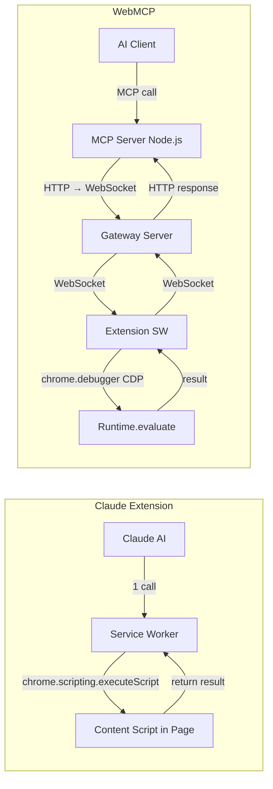

# 🔬 Deep Analysis: Tại sao Claude `get_page_text` nhanh & tốt — và cách WebMCP cải tiến

## 1. Kiến trúc tổng thể — Sự khác biệt cốt lõi



> [!IMPORTANT]
> **Khác biệt kiến trúc lớn nhất**: Claude chạy **tất cả trong cùng 1 extension process** — tool call được handle trực tiếp bởi service worker mà không đi qua network hop nào. WebMCP phải đi qua **4+ network hops** (MCP Server → HTTP → Gateway → WebSocket → Extension → CDP → Page → ngược lại).

---

## 2. Claude `get_page_text` — Reverse-Engineering chi tiết

### 2.1 Pipeline thực thi

| Bước | Chi tiết | Latency |
|---|---|---|
| 1. Tool dispatch | Service worker nhận `tool_call` message từ stream, lookup handler `get_page_text` từ `toolHandlers` map, gọi trực tiếp | ~0ms (in-memory) |
| 2. Permission check | `permissionManager.checkPermission(url, toolUseId)` — kiểm tra domain trong cached whitelist | ~1-5ms |
| 3. Execute in page | `chrome.scripting.executeScript()` — inject function trực tiếp vào tab | ~50-100ms |
| 4. Return result | Structured object trả về trực tiếp, format string đơn giản | ~1ms |

**Tổng**: ~50-110ms

### 2.2 Smart Content Extraction Algorithm

Đây là **bí quyết chính** khiến Claude trả text sạch:

```javascript
// Claude's content extraction priority list (decompiled):
const SELECTORS = [
  "article",                       // HTML5 semantic article
  "main",                          // HTML5 main content
  '[class*="articleBody"]',        // Schema.org pattern
  '[class*="article-body"]',       // Common CSS pattern
  '[class*="post-content"]',       // WordPress/Blog pattern
  '[class*="entry-content"]',      // WordPress standard
  '[class*="content-body"]',       // News sites
  '[role="main"]',                 // ARIA landmark
  ".content",                      // Generic content class
  "#content"                       // Generic content ID
];
```

Logic:
1. **Thử từng selector** theo thứ tự ưu tiên
2. Nếu có nhiều match → chọn element có `innerText` dài nhất
3. Nếu không match nào → fallback về `document.body`
4. **Cleanup**: normalize whitespace + collapse blank lines
5. **Guard**: nếu text < 10 chars → báo lỗi "no content"
6. **Guard**: nếu text > max_chars → báo lỗi + suggest alternatives

### 2.3 Tại sao dùng `chrome.scripting.executeScript` thay vì CDP

| Aspect | `chrome.scripting.executeScript` (Claude) | CDP `Runtime.evaluate` (WebMCP) |
|---|---|---|
| API layer | Chrome Extensions API (high-level) | Chrome DevTools Protocol (low-level) |
| Debugger attach | ❌ Không cần | ✅ Phải `chrome.debugger.attach()` trước |
| Debugger banner | ❌ Không hiện | ⚠️ Hiện dòng "đang được kiểm soát" |
| Speed | ⚡ Nhanh hơn (~50ms) | 🐢 Chậm hơn (~100-200ms, phải attach + evaluate) |
| Permission | Chỉ cần `scripting` + `activeTab` | Cần `debugger` permission |
| Return by value | ✅ Tự serialize | ✅ `returnByValue: true` |
| World | MAIN (truy cập DOM trực tiếp) | Default isolated, cần `userGesture: true` |

---

## 3. WebMCP `getPageContent` — Phân tích hiện trạng

### 3.1 Pipeline hiện tại

| Bước | Chi tiết | Latency |
|---|---|---|
| 1. MCP Server nhận call | Node.js MCP server parse JSON-RPC | ~5ms |
| 2. HTTP → Gateway | MCP server POST tới gateway HTTP server | ~10-20ms |
| 3. Gateway → Extension WS | Gateway chuyển qua WebSocket | ~5-10ms |
| 4. Extension dispatch | Lookup handler, resolve tabId | ~5ms |
| 5. CDP attach (if needed) | `chrome.debugger.attach()` + ensure | ~0-200ms (first time) |
| 6. Runtime.evaluate | CDP evaluate expression | ~50-100ms |
| 7. Result back through chain | Extension → WS → Gateway → HTTP → MCP | ~20-40ms |

**Tổng**: ~100-380ms (first call with attach), ~80-180ms (subsequent)

### 3.2 Điểm mạnh hiện tại của WebMCP

- ✅ `evaluateJS` cho phép **arbitrary JS execution** — linh hoạt hơn
- ✅ CDP access cho phép **full browser control** (network intercept, input events, etc.)
- ✅ `getPageContent` đã có pagination (`offset`, `maxLength`)
- ✅ `querySelectorAll` cho structured extraction
- ✅ Shadow DOM piercing
- ✅ Frame targeting

### 3.3 Điểm yếu so với Claude

1. **`getPageContent` trả raw `document.body.innerText`** — không có smart content detection
2. **Phải gọi nhiều tool** để đạt cùng kết quả (navigate → waitForStable → evaluateJS)
3. **CDP overhead** — attach debugger, maintain connection
4. **Network hops** — Extension ↔ Gateway ↔ MCP Server

---

## 4. 💡 Suggestions để Improve WebMCP

### 4.1 🔴 Priority 1: Thêm tool `getPageText` (smart extraction)

Tạo tool mới giống Claude — **không cần thay đổi kiến trúc**, chỉ thêm handler mới:

```javascript
// Thêm vào high-level.js
async getPageText(params) {
  const tabId = await resolveTabId(params);
  const { maxLength = 50000 } = params;
  const { evaluate, frameTarget } = await getEvaluator(tabId, params.frame);

  const result = await evaluate(`
    (() => {
      const selectors = [
        "article", "main", '[class*="articleBody"]',
        '[class*="article-body"]', '[class*="post-content"]',
        '[class*="entry-content"]', '[class*="content-body"]',
        '[role="main"]', ".content", "#content"
      ];
      const maxLen = ${Number(maxLength)};
      
      let best = null;
      for (const sel of selectors) {
        const els = document.querySelectorAll(sel);
        if (els.length > 0) {
          let largest = els[0], maxSize = 0;
          els.forEach(el => {
            const len = el.innerText?.length || 0;
            if (len > maxSize) { maxSize = len; largest = el; }
          });
          best = largest;
          break;
        }
      }
      if (!best) best = document.body;
      
      const raw = (best.innerText || "")
        .replace(/[^\\S\\n]+/g, " ")
        .replace(/ ?\\n ?/g, "\\n")
        .replace(/\\n{3,}/g, "\\n\\n")
        .trim();
      
      if (!raw || raw.length < 10) {
        return { text: "", source: "none", error: "No text content found" };
      }
      
      const total = raw.length;
      const text = raw.slice(0, maxLen);
      return {
        title: document.title,
        url: location.href,
        source: best.tagName.toLowerCase(),
        text,
        totalLength: total,
        truncated: total > maxLen,
      };
    })()
  `);
  return { tabId, ...framePayload(frameTarget), ...result };
}
```

> [!TIP]
> Đây là thay đổi **impact cao nhất, effort thấp nhất** — chỉ cần thêm 1 handler function.

### 4.2 🟡 Priority 2: Dual-path execution (scripting API + CDP fallback)

Thêm path dùng `chrome.scripting.executeScript` cho các tool read-only (không cần debugger):

```javascript
// Thêm vào cdp-bridge.js
export async function evaluateViaScripting(tabId, func, args = []) {
  return new Promise((resolve, reject) => {
    chrome.scripting.executeScript({
      target: { tabId },
      world: 'MAIN',
      func,
      args,
    }, (results) => {
      if (chrome.runtime.lastError) {
        reject(new Error(chrome.runtime.lastError.message));
        return;
      }
      resolve(results?.[0]?.result);
    });
  });
}
```

**Lợi ích**:
- Không cần `chrome.debugger.attach()` → bỏ debugger banner
- Nhanh hơn ~50-100ms mỗi call
- Dùng cho: `getPageContent`, `getPageText`, `querySelectorAll`, `findByText`, `getWindowVariable`
- CDP path vẫn giữ cho: `dispatchClick`, `moveMouse`, `pressKey`, network intercept, etc.

### 4.3 🟡 Priority 3: "One-shot" composite tool

Claude chỉ cần 1 tool call (`get_page_text`). WebMCP hiện cần 2-4 calls. Thêm tool composite:

```javascript
async readPage(params) {
  const { url, waitMs = 2000, maxLength = 50000 } = params;
  const tabId = params.tabId || await resolveTabId(params);
  
  // Nếu có URL → navigate trước
  if (url) {
    await chrome.tabs.update(tabId, { url });
    await waitForPageStable(tabId, { maxWaitMs: waitMs });
  }
  
  // Dùng getPageText logic
  return this.getPageText({ tabId, maxLength });
}
```

### 4.4 🟢 Priority 4: Giảm network hops cho MCP flow

Hiện tại: `MCP Server (Node) → HTTP → Gateway → WS → Extension`

Cải thiện có thể:
- **Option A**: Extension tự expose MCP server qua `nativeMessaging` (như Claude làm) — nhưng phức tạp
- **Option B**: Merge MCP Server + Gateway thành 1 process (đã làm phần nào)
- **Option C**: Chấp nhận overhead vì nó chỉ ~20-40ms — không đáng để phá kiến trúc

### 4.5 🟢 Priority 5: Content script pre-injection (như Claude)

Claude inject [accessibility-tree.js](file:///Users/ttcenter/Desktop/REF_CODE/claude-chrome-ext/assets/accessibility-tree.js-CCweLwU2.js) vào **mọi trang** lúc `document_start`. Khi cần dùng, function `__generateAccessibilityTree` đã sẵn trong page — không cần inject lại.

WebMCP có thể làm tương tự cho text extraction:

```json
// manifest.json
"content_scripts": [{
  "js": ["content/text-extractor.js"],
  "matches": ["<all_urls>"],
  "run_at": "document_idle",
  "all_frames": false
}]
```

Nhưng **lợi ích marginal** vì `evaluateInTab` + inline expression cũng rất nhanh.

---

## 5. Tóm tắt

| Yếu tố | Claude | WebMCP | Khoảng cách |
|---|---|---|---|
| **Số tool calls cần** | 1 (`get_page_text`) | 2-4 (navigate + wait + evaluate) | Lớn → Fix bằng P1+P3 |
| **Smart content detection** | ✅ 10 semantic selectors | ❌ Raw `body.innerText` | Lớn → Fix bằng P1 |
| **Text cleanup** | ✅ Whitespace normalization | ❌ Raw text | Lớn → Fix bằng P1 |
| **Execution path** | In-process, ~50ms | CDP + 4 hops, ~100-380ms | Vừa → Fix bằng P2 |
| **Debugger dependency** | ❌ Không cần | ✅ Bắt buộc | Vừa → Fix bằng P2 |
| **Structured extraction** | ❌ Text only | ✅ querySelectorAll, evaluateJS | WebMCP thắng |
| **Frame support** | Basic | ✅ Full frame targeting | WebMCP thắng |
| **Shadow DOM** | ❌ | ✅ pierceShadow | WebMCP thắng |

> [!IMPORTANT]
> **Kết luận**: WebMCP không cần thay đổi kiến trúc lớn. Chỉ cần **thêm 1 handler `getPageText`** (Priority 1) với smart content detection algorithm giống Claude là đã bù đắp được phần lớn khoảng cách về trải nghiệm "đọc nhanh nội dung trang". WebMCP vẫn mạnh hơn Claude ở bulk extraction, structured data, và full browser control.

---

## 6. Trạng thái triển khai (cập nhật 2026-06-29, v1.0.16)

Sau khi đánh giá lại, các đề xuất được triển khai như sau:

| Đề xuất | Quyết định | Lý do |
|---|---|---|
| **P1 — `getPageText`** | ✅ **Đã triển khai** | Impact cao / effort thấp. Cải tiến so với bản nháp: duyệt **tất cả** selector và chọn container có nhiều text nhất (thay vì "selector đầu tiên thắng" — tránh dính phải thẻ `<article>` card nhỏ), thêm pagination `offset`/`maxLength`, báo `source`, guard nội dung rỗng. Logic page-side tách ra [page-text-extract.js](../../webmcp-extension/dist/bg/handlers/page-text-extract.js) + unit test. |
| **P3 — `readPage`** | ✅ **Đã triển khai** | Đóng đúng khoảng cách "1 call vs 4 calls": navigate (tùy chọn) → chờ load → `waitForStable` → trích text, gộp trong 1 tool call. Compose lại các hàm sẵn có, rủi ro thấp. |
| **P2 — dual-path `chrome.scripting.executeScript`** | ❌ **Không triển khai** | Lý do chính của P2 (bỏ "debugger banner") **gần như vô hiệu trong thực tế**: một phiên WebMCP đã `attach` CDP cho navigate/click/scroll, nên banner đã hiện sẵn bất kể. Thêm một code path thực thi song song chỉ để tiết kiệm vài chục ms là không xứng với độ phức tạp & bề mặt bảo trì. Cần thêm quyền `scripting` (thay đổi với người dùng). |
| **P4 — giảm network hops** | ❌ **Không triển khai** | Chính doc kết luận "Option C: chấp nhận overhead ~20-40ms". |
| **P5 — content-script pre-injection** | ❌ **Không triển khai** | Chính doc đánh giá lợi ích marginal; `evaluateInTab` + inline expression đã đủ nhanh. |
